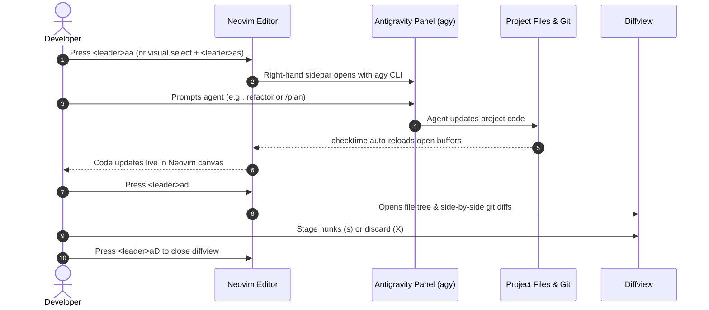

# Walkthrough: Antigravity IDE Experience in Neovim

We have configured and deployed a native Antigravity IDE workflow directly inside Neovim on NixOS. This keeps Neovim as your primary editor while giving you a toggleable side panel running the Antigravity CLI (`agy`), automatic real-time buffer synchronization, and side-by-side git diff review.

---

## What Was Changed

### 1. Declarative Home Manager Configuration
Updated [dev.nix](file:///home/liam/os-setup/nixos/home/modules/dev.nix) to generate [antigravity.lua](file:///home/liam/.config/nvim/lua/plugins/antigravity.lua) in `~/.config/nvim/lua/plugins/`.

### 2. Core Capabilities Implemented

#### A. Dedicated Toggleable Sidebar & Float Panels
- Implemented via `snacks.terminal` to run `agy` persistently without killing your session when toggled away.
- Defaults to a 38% width right-docked vertical split mirroring the Antigravity IDE sidebar chat.
- Fast toggle from terminal insert mode via `<A-a>` (Alt+a).

#### B. Instant File Synchronization (`autoread` + `checktime`)
- Configured an `AntigravityAutoRead` autocommand group listening to `FocusGained`, `BufEnter`, `CursorHold`, `TermLeave`, and `TermClose`.
- Open buffers in Neovim automatically reload disk changes applied by the agent without interruption.

#### C. Full Visual Diff Review System
- Integrated `sindrets/diffview.nvim` for comprehensive review of all files modified by the agent.
- Provides a side-by-side diff against `HEAD` with a dedicated file drawer to stage, discard, or jump between hunks.

#### D. Context Injection (Cmd+I equivalent)
- Visual selection helper `<leader>as` converts highlighted code into an `@file:Lstart-Lend` reference, opens/focuses the Antigravity sidebar, and pastes it into the prompt.
- File reference helper `<leader>af` sends `@file` into the agent.

---

## Quick Reference Keymaps

All actions are grouped under `<leader>a` in `which-key`:

| Keybinding | Mode | Action | Description |
| :--- | :--- | :--- | :--- |
| `<C-h>` | Normal & Terminal | **Smart Focus Toggle** | Bounces focus between Code and `agy` (enters insert mode in agy, normal mode in code) |
| `<A-a>` | Normal & Terminal | **Universal Toggle** | Shows/hides the `agy` sidebar without touching window splits |
| `<Esc>` | Terminal | **Normal Mode** | Single press immediately enters Normal mode in the terminal buffer |
| `<C-w>` | Terminal | **Window Prefix** | Standard window navigation (`<C-w>h`, `<C-w>w`, `<C-w>p`) from terminal |
| `<leader>aa` | Normal | **Toggle Sidebar** | Opens or hides the right-hand persistent `agy` sidebar |
| `<leader>ac` | Normal | **Continue Session** | Launches or restores `agy --continue` |
| `<leader>ap` | Normal | **Plan Mode** | Launches `agy --mode plan` for planning sessions |
| `<leader>aA` | Normal | **Toggle Float** | Opens `agy` in a centered floating scratchpad |
| `<leader>ad` | Normal | **Diffview Open** | Opens the side-by-side diff review across all changed files |
| `<leader>aD` | Normal | **Diffview Close** | Closes diffview and returns to standard workspace layout |
| `<leader>ah` | Normal | **File History** | Opens git revision history for the active file |
| `<leader>as` | Visual | **Send Selection** | Sends `@filepath:Lstart-Lend` directly to the `agy` prompt |
| `<leader>af` | Normal | **Send File** | Sends `@filepath` reference to the `agy` prompt |

---

## Workflow Demonstration

---

## Verification & Testing

1. **Flake & Nix Evaluation**:
   - `nix flake check --no-build` passed cleanly with all format and architecture checks intact.
   - `nix build .#nixosConfigurations.wsl.config.system.build.toplevel --no-link` built successfully.
2. **NixOS System Switch**:
   - Executed `sudo nixos-rebuild switch --flake /home/liam/os-setup/nixos#wsl`.
   - Verified symlink created at [antigravity.lua](file:///home/liam/.config/nvim/lua/plugins/antigravity.lua).
3. **Neovim Plugin & Keymap Validation**:
   - Verified Lazy.nvim cloned and loaded `diffview.nvim` without error.
   - Tested autocommand group `AntigravityAutoRead` registration across `BufEnter`, `CursorHold`, `FocusGained`, `TermLeave`, and `TermClose`.
   - Confirmed keybindings registered under `<leader>a` in normal mode, visual mode (`<leader>as`), and terminal mode (`<A-a>`).
